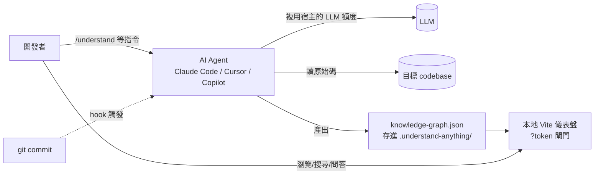
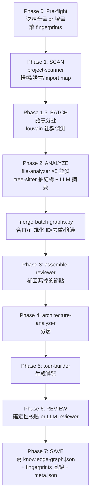

# Teardown #01 — Understand Anything

> **一句話定位:** 一個寄生在 AI coding agent(Claude Code / Cursor / Copilot…)裡的 codebase 理解引擎 —— 用「tree-sitter 抽結構 + LLM 補語意」把任意專案轉成可互動、可版控的知識圖譜。
> **Repo:** github.com/Lum1104/Understand-Anything · **License:** MIT · **語言/框架:** TypeScript(核心)+ Python/JS(管線腳本)+ React/Vite(前端) · **拆解日期:** 2026-06-01 · **規模(本次分析其插件子目錄):** 298 檔 / 521 nodes / 659 edges

> 📌 這篇是用**它自己**分析它自己產出的(`/understand --language zh`),再由我手動補上決策與取捨評註。素材一手,坑也親自踩過(見最後一節)。

---

## 0. 為什麼拆它

它一度衝上 GitHub trending #1。但拆完我的結論是:**它的價值不在演算法新穎,而在「把一個合理的想法包成零摩擦的能力,放對渠道」。** 對一個想走系統架構師的人,這比學一個炫技演算法更值得 —— 因為「分發、封裝、取捨」正是架構師的核心,而非寫出最快的 parser。

它解決的痛點很真實:**「你剛進新團隊,面對 20 萬行 code,從哪開始?」** 這是每個架構師/資深工程師反覆遇到的問題。

---

## 1. Context(C4 L1)— 它跟外界誰互動

關鍵觀察:它**沒有自己的後端、沒有自己的 LLM key**。LLM 算力借宿主 agent 的訂閱,執行環境借 agent 的工具(Bash/Read/Grep),分發借 plugin marketplace。這一條就決定了它的採用曲線。

---

## 2. 分層 / 容器(C4 L2)

工具自動分出 6 層,我驗證後認為命名合理,對應如下:

| 層 | 節點數 | 職責 | 關鍵模組 |
|----|-------:|------|----------|
| **核心分析引擎** `packages/core` | 102 | 圖構建、語言/框架配置、tree-sitter 提取、persistence、search、schema | `analyzer/`, `plugins/`, `fingerprint.ts`, `staleness.ts`, `schema.ts` |
| **儀表盤 UI** `packages/dashboard` | 65 | React + React Flow + Zustand 視覺化(ELK 佈局、主題、i18n) | `GraphView.tsx`, `store.ts`, `elk-layout.ts` |
| **Prompt 定義與文檔** `agents/` `skills/` | 57 | 驅動 agent 行為的 prompt;語言/框架/locale 片段 | `agents/*.md`, `skills/*/SKILL.md` |
| **測試** `__tests__` | 46 | Vitest 單元測試 | `*.test.ts` |
| **Skill 源碼與管線腳本** `src/` | 16 | chat/diff/explain/onboard 邏輯 + `.mjs`/`.py` 管線 | `src/*.ts`, `compute-batches.mjs`, `merge-batch-graphs.py` |
| **配置** | 12 | monorepo 構建/工作區配置 | `package.json`, `pnpm-workspace.yaml`, `plugin.json` |

**架構洞察:** 它把自己也設計成了「核心引擎(可重用)+ prompt 層(行為)+ UI 層(呈現)」的三明治。prompt 層獨立成檔(而非寫死在 code 裡)是刻意的 —— 這讓**非工程師也能調整 agent 行為**,也讓同一引擎能換不同 prompt 跑出 chat/diff/explain/onboard/domain/knowledge 等多個 skill。**Graph 是底層基板,skill 是它的多個下游消費者。**

---

## 3. 主幹流程 — `/understand` 建圖管線

這條 7 階段管線是整個系統的靈魂:

**值得學的設計:**
- **每階段 subagent 把結果寫磁碟,不回灌主 context**(見 ADR-2)。
- **確定性與 LLM 交錯**:scan/batch/merge/validate 是確定性腳本(Python/JS),analyze/architecture/tour 是 LLM subagent。脆弱的語意交給 LLM,需要正確性的交給 code。
- **每階段都有「正規化/校驗」收口**:LLM 輸出不可信,所以 merge 階段會修正 ID 雙前綴、翻轉 `tested_by` 方向、丟棄 dangling edge;reviewer 階段再補漏。**這是把不穩定的 LLM 產出馴化成穩定 artifact 的關鍵工程量。**

---

## 4. ★ 關鍵決策與取捨(ADR)

### ADR-1: 用 web-tree-sitter(WASM)而非原生 tree-sitter
- **脈絡:** 需要跨平台抽程式碼結構;原生 tree-sitter binding 在 **darwin/arm64 + Node 24** 編譯失敗。
- **決策:** 全面改用 `web-tree-sitter`(WASM)。
- **替代方案(被否決):** 原生 binding(較快但裝不起來)、自寫 regex parser(不可靠)、純 LLM 抽結構(會幻覺、貴)。
- **代價:** WASM 比原生慢、初始化要載 `.wasm`;換來「在任何使用者機器上都裝得起來」—— 對一個要靠廣泛採用的工具,**可移植性 > 速度**。
- **佐證:** `CLAUDE.md` Gotchas 段明列。
- **架構教訓:** 給「別人機器上跑」的工具,部署可靠性的權重遠高於效能。

### ADR-2: 中間結果落地磁碟,不回灌 agent context
- **脈絡:** 大型 repo 分批 LLM 分析,若每批結果都回主 agent,context window 會爆。
- **決策:** 每個 subagent 把結果寫 `.understand-anything/intermediate/batch-N.json`,主流程只調度、不持有內容,最後用腳本彙整。
- **替代方案(被否決):** 全進 context(撐不過大專案)、用 vector DB(增加外部依賴,違背 P1 的零基礎設施)。
- **代價:** 多了檔案 I/O、命名規約、清理與失敗恢復邏輯;換來**可處理任意規模**。
- **連結 pattern:** [P3 中間檔繞 context 上限](../patterns/#p3--中間結果落地以繞過-context-上限)

### ADR-3: 產出固化成可版控 artifact + fingerprint 增量更新
- **脈絡:** AI 產出若是一次性 session,無法版控、無法團隊共享、每次重跑很貴。
- **決策:** 把圖存成 `knowledge-graph.json` 進 repo;用 `fingerprint.ts` 算每檔結構指紋(內容 hash + 函式/類簽名 + import/export),`change-classifier.ts` 區分「外觀變更 vs 結構變更」,git hook 在 commit 後**只重分析變動檔**。
- **替代方案(被否決):** 每次全量重跑(慢且貴)、不更新(圖會過時失信)。
- **代價:** 要正確處理「新鮮度」—— 而且這裡有個**真實的順序 bug**:fingerprint 基線必須在 `meta.json` 之前寫成功,否則 auto-update 會把每個檔都當 STRUCTURAL,每次 commit 都升級成 FULL_UPDATE(issue #152)。
- **佐證:** issue #152、`SKILL.md` Phase 7 明確警告「fingerprints 成功前不可寫 meta.json」。
- **連結 pattern:** [P2 Artifact 而非 Session](../patterns/#p2--artifact-而非-session)
- **架構教訓:** 「增量更新」聽起來簡單,真正的複雜度在**狀態一致性的寫入順序**。一個順序錯誤就讓整個增量機制退化成全量。

### ADR-4: agent 定義刻意**省略** `model` 欄位
- **脈絡:** 要同時支援 Claude / Codex / Cursor / opencode 等多平台。
- **決策:** agent frontmatter 不寫 `model`,讓各平台 fallback 到自己的預設。
- **替代方案(被否決):** 寫 `model: inherit` —— 那是 Claude Code 專屬關鍵字,opencode 會把它當成字面 model id,報 `ProviderModelNotFoundError`。
- **代價:** 放棄對模型的精確控制;換來真正的跨平台。
- **佐證:** issue #167。
- **架構教訓:** 跨平台相容性常常是「**少寫**」而非「多寫」—— 最小化對單一平台專屬語意的依賴。

### ADR-5: 把工具做成 agent plugin,而非獨立產品
- **脈絡:** 要取得採用,最大摩擦是「要不要離開現有工作流、要不要設定 API key/部署」。
- **決策:** 做成 Claude Code / Cursor / Copilot 的 skill/plugin,複用宿主的 LLM 額度與執行環境。
- **替代方案(被否決):** 獨立 CLI(要自己管 LLM key)、SaaS(要部署、要信任上傳)、VS Code 原生擴充(綁單一編輯器)。
- **代價:** 受制於宿主平台能力與生命週期(例:worktree 是 ephemeral,得特別 redirect 輸出到主 repo 才不會被刪 —— issue #133);護城河淺,別人幾天能抄。
- **連結 pattern:** [P1 分發即架構](../patterns/#p1--分發即架構distribution-as-architecture)
- **架構教訓:** **這是它衝上 #1 的真正原因。** 採用率不是功能函數,是摩擦函數。

### ADR-6: core 用 subpath exports 把 Node 模組擋在瀏覽器外
- **脈絡:** 同一個 `core` 套件,既被 Node 管線用,又被瀏覽器 dashboard 用;但 dashboard 不能 bundle 進 `fs`/`path` 等 Node 內建。
- **決策:** core 暴露 `./search`、`./types`、`./schema` 等 browser-safe 子路徑;dashboard 只准 import 這些,絕不碰主 entry。
- **代價:** 多維護一套 export map、開發者得記住規約;換來一份 core 程式碼同時服務兩種 runtime。
- **架構教訓:** 「同構(isomorphic)」共用 code 的邊界,要靠**封裝邊界(export 面)**強制,而非靠紀律。

---

## 5. ★ 為什麼聰明 / 我會挑戰什麼

**非顯而易見的好招:**
1. **Hybrid 分工**(tree-sitter 骨架 + LLM 語意):純靜態圖沒人看,純 LLM 會幻覺,縫起來才同時可信又可讀。[P4]
2. **能上 GIF 的視覺**:dark luxury 主題 + React Flow 圖,trending 很吃「30 秒影片看起來很猛」。視覺投資是分發策略的一部分,不是裝飾。
3. **一次建圖,多 skill 複用**:chat/diff/explain/onboard/domain/knowledge 全吃同一張圖 —— 邊際成本遞減。

**我會挑戰的地方(architect 的批判視角):**
1. **成本不透明且可能很高**:我實測跑它自己,21 個 batch、多個 subagent,token 消耗可觀。對 200k LOC 的真實大 repo,「>100 檔請縮小範圍」的提示暴露了**規模天花板**。它對「大型專案」的承諾與「請縮小範圍」的現實之間有張力。
2. **圖的可信度**:LLM 會漏節點/造假邊 —— 我這次就有 2 條 edge 指向不存在的節點被丟棄、再由 reviewer 補回。**使用者怎麼知道圖是對的?** 沒有信賴度標示,容易「看起來權威但其實有錯」。
3. **零護城河**:架構合理 = 易複製。它贏在「早 + 完整 + 渠道對」,不是技術壁壘。一旦宿主平台(如 Claude Code)內建類似能力,它的空間會被擠壓。
4. **新鮮度的信任問題**:若使用者沒設 git hook,圖會悄悄過時,而過時的圖比沒有圖更危險(誤導)。
5. **環境門檻**:需要 Node ≥22 + pnpm ≥10,對「只想看圖」的非 JS 開發者是隱形摩擦(我親自踩到,見下節)。

---

## 6. ★ 我會偷走的 pattern

| Pattern | 適用情境 | 連結 |
|---------|----------|------|
| 分發即架構 | 任何要取得採用的開發者工具 —— 先問「能不能寄生在使用者已開的工具裡」 | [P1](../patterns/#p1--分發即架構distribution-as-architecture) |
| Artifact 而非 Session | 任何 AI 輔助產出 —— 讓結果可版控、可離線、可進 CI | [P2](../patterns/#p2--artifact-而非-session) |
| 中間檔繞 context 上限 | 任何 LLM 多步驟、大輸入的 pipeline | [P3](../patterns/#p3--中間結果落地以繞過-context-上限) |
| 確定性骨架 + LLM 語意 | 任何「要正確又要可讀」的分析任務 | [P4](../patterns/#p4--hybrid確定性骨架--llm-語意) |
| Plugin Registry 擴充性 | 任何要支援 N 種輸入格式/語言的系統 | [P5](../patterns/#p5--plugin-registry-做語言能力擴充性) |

---

## 7. 風險 / 未解問題 / 演化方向

- **規模成本**:LLM 呼叫量隨檔數線性成長,大 repo 的時間與 token 成本是主要瓶頸。可能的演化:更激進的「只分析改動 + 摘要快取」。
- **平台依賴**:命脈繫於宿主 agent 的 plugin API 與 LLM 額度政策。
- **24 種語言配置的維護**:tree-sitter grammar 與語言演化的追趕成本。
- **信任機制缺位**:未來若加「節點/邊的信賴度標示」「與原始碼的可追溯連結」,會大幅提升可用性。
- **單 repo 單圖**:跨 repo / monorepo 多專案的關係目前不是一等公民。

---

## 附:我的拆解過程(方法展示)

1. **用它分析它自己**:`/understand --language zh` 於其插件子目錄(298 檔)→ 21 batch、5 並發 subagent → 521 nodes / 659 edges。
2. **驗證而非盡信**:逐層檢查分層命名、抽查節點摘要、確認 reviewer 補回的 2 個漏節點(`DomainGraphView`、`useDashboardStore`)。
3. **踩到的真實坑(本身就是架構觀察)**:這台機器**沒有系統級 Node/pnpm**,我得用 bun + Cursor 內建 node 把分析引擎 bootstrap 起來 —— 親身印證了 ADR-1(可移植性)與「環境門檻」這個風險。後來才用 nvm 裝正規 Node 22 + pnpm 跑起 dashboard。
4. **決策考古**:ADR 段的 issue 編號(#133/#152/#167)來自 repo 的 `CLAUDE.md` 與 commit/issue 紀錄 —— **決策評註要有佐證,不能憑猜。**

> 方法論本身就是訊號:我展示的不是「我會用一個工具」,而是「我有一套**驗證 + 批判 + 歸納**的拆解方法」。
